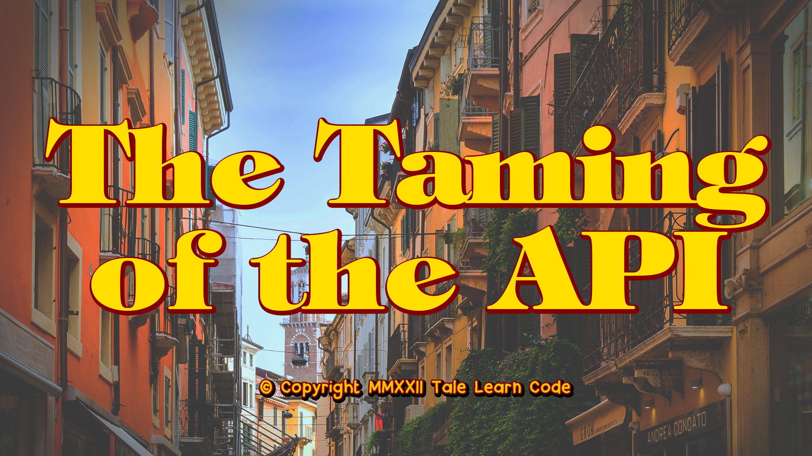

## Abstract
Tranio tells Lucentio, “No profit grows where is no pleasure ta’en: In brief, sir, study what you most affect.” While Tranio’s point was to get Lucentio to loosen up for him to “live a little,” this is still a valuable lesson to developers. Your team has worked hard to build the functionality that provides all of your customers’ needs, but how easily have you made it for them to access that? Sometimes building the API is the easy part; making them usable is the hard part. But by adding an API gateway, we can make it easier for customers to access functionality and data provided by your application.

In this presentation, we will look at API gateways in general and how to use them to make your APIs usable. We’ll then go into examples using Azure’s API Management service, which allows you to streamline work in Azure and across hybrid and multi-cloud environments to provide your customers with a single place to work with your APIs.

## Short Abstract
We will look at API gateways in general and how to use them to make your APIs usable. We’ll then go into examples using Azure’s API Management service, which allows you to streamline work in Azure and multi-cloud environments to provide your customers with a single place to work with your APIs.

# Type
* 45/60/75-minute session

## Tags
* .NET
* .NET Core
* APIs
* Architecture
* Azure
* C#
* Cloud
* Cloud-Native
* Software Design
* Microservices
* Microsoft
* Serverless

## Learning Objectives
* Understand what an API gateway is and how it can help improve the usability of your APIs
* Learn how to setup Azure API Management to publish you APIs to the world
* Learn about the tips and tricks to get the most out of Azure API Management

## Presentations

| Event | Location | Date | Time | Room | Downloads |
|-------|:--------:|-----:|-----:|-----:|----------:|
| [Indy.Code](https://indycode.amegala.com/) | Carmel, IN | October 19, 2022 | TBA | TBA | Available Afterwards |
| [Beer City Code](https://www.beercitycode.com/) | Grand Rapids, MI | August 6, 2022 | 5:00 pm EDT | Available Afterwards |
| [Nebraska.Code()](https://nebraskacode.amegala.com/Sessions/1357) | Lincoln, NE | July 15, 2022 | 2:30 pm CDT | Wabash | [Slides](Presentations/TheTamingOfTheAPI_NebraskaCode.pdf) | 
| [dev up 2022](https://www.devupconf.org/speakers/chad-green) | St. Charles, MO | June 8, 2022 | 4:00 pm CDT | Imagination C & D | [Slides](Presentations/The%20Taming%20of%20the%20API%20-%20DevUp.pdf) | 
| [dev up 2022](https://www.devupconf.org/speakers/chad-green) | St. Charles, MO | June 8, 2022 | 4:00 pm CDT | Imagination C & D | [Slides](Presentations/The%20Taming%20of%20the%20API%20-%20DevUp.pdf) | 
| [CodeStock](https://www.codestock.org/) | Knoxville, TN | April 7, 2022 | 1:55 pm EDT | Ballroom B | [Slides](Presentations/The%20Taming%20of%20the%20API%20-%20CodeStock.pdf) |
